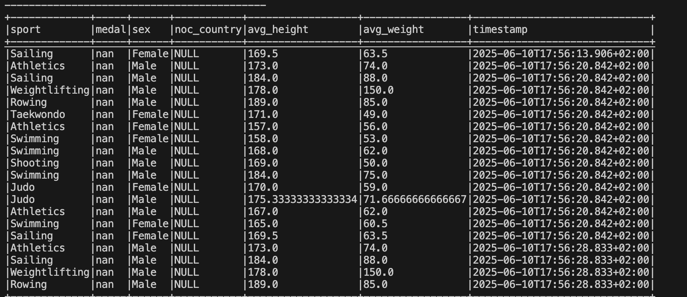

# Фінальний проєкт з курсу

### Результати виконаного завдання № 1

#### Запис даних у таблицю MySQL

#### Запис даних у Kafka-топік

## Part 2 | Building an Batch Data Lake

### - Запис даних у таблицю bronze/athlete_event_results

### - Запис даних у таблицю silver/athlete_event_results

### - Запис даних у таблицю gold/avg_stats

### - DAG з трьома відпрацьованими завданнями

